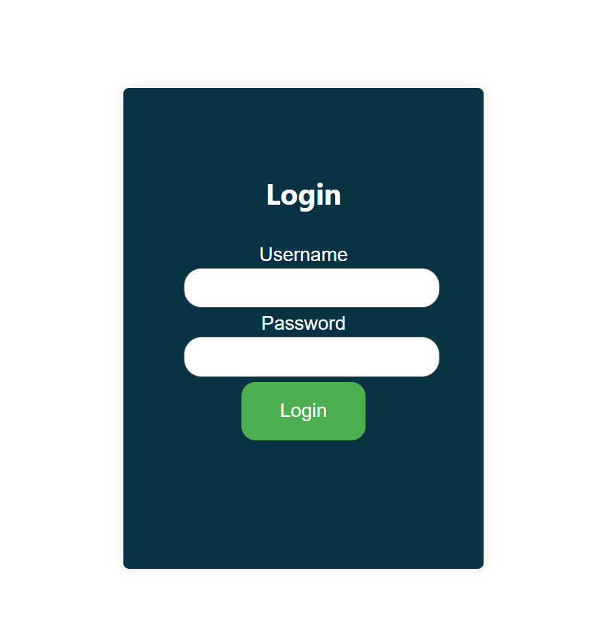
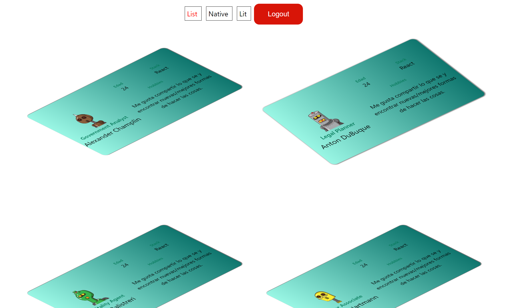
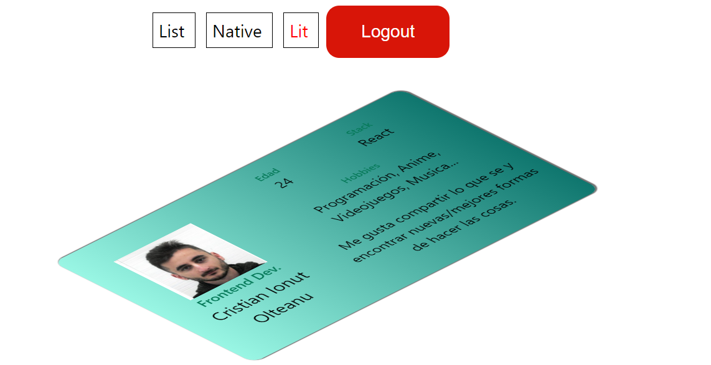
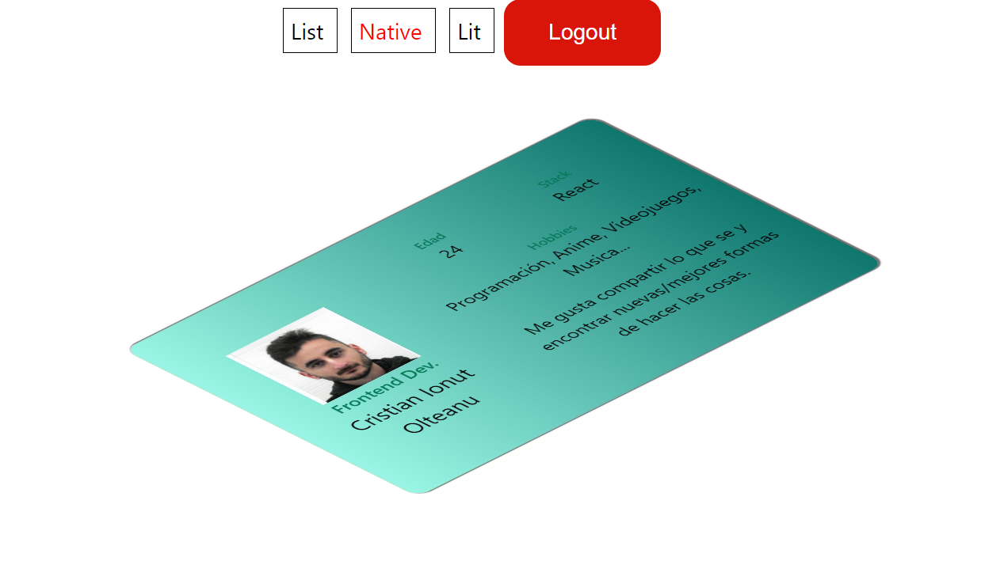
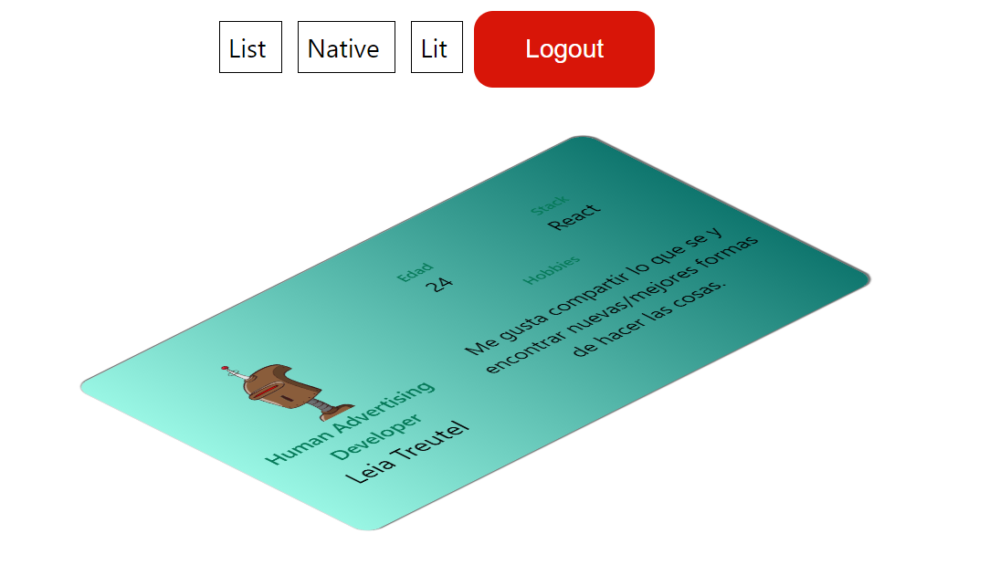

# pequeño proyecto con lit.
## Imagenes del proyecto levantado
### Login

### List

### Lit

### Native

### Detail

## ¿Como navegar sobre el proyecto?
### Recomendaciones al navegar sobre el proyecto
* Abrir la terminal en el apartado de Network para ver como va importando los archivos js a medida que los necesita (lazy loading)
* Hacer hover sobre los cards y hacer click en los mismos (sobre todo en el listado)
* Poner un usuario y contraseña incorrectos al iniciar sesión

### Ejecutar el proyecto
1. Instalar dependencias (puedes utilizar npm pero te recomiendo yarn).

        yarn install

2. Ejecutar el proyecto.

        yarn dev

3. Ir al siguiente enlace http://localhost:5173/login
3. Iniciar sesión con 1234 │ 1234

### Visualizar que los tests estan pasando

1. Ejecutar los test.

        yarn test

2. Ir al navegador por defecto, ya que se supone que te tiene que abrir automaticamente una ventana con el vitest.

## Arquitectura

### Router
Para el enrutado he creado mi propio router con lazy loading.

### Sistema de notificaciones
Para el sistema de notificaciones he creado un snackbar y un contexto de snackbar para mostrar diferentes mensages en toda la aplicación.

### Sistema de carga
He creado un loader que esta como contexto en la aplicación y se activa/desactiva mediante eventos.

Tambien a nivel de page he creado un tipo de page que contiene llamadas asyncronas y mientras este llamando a un endpoint los elementos se ponen en suspension. 

### Estructura de carpetas
        ./
        ├── html/
        │   ├── assets
        │   ├── bg.png
        │   ├── favicon.svg
        │   ├── html.meta.json
        │   └── index.html
        ├── node_modules
        ├── public/
        │   └── vite.svg
        ├── src/
        │   ├── api/
        │   │   ├── formaters/
        │   │   │   └── user.ts
        │   │   ├── api.ts
        │   │   ├── endpointPaths.ts
        │   │   ├── formater.ts
        │   │   ├── login.ts
        │   │   └── user.ts
        │   ├── challenges/
        │   │   ├── challenge8.test.ts
        │   │   ├── isPangram.test.ts
        │   │   ├── isPangram.ts
        │   │   ├── uniqueLetters.test.ts
        │   │   └── uniqueLetters.ts
        │   ├── component/
        │   │   ├── snackbar/
        │   │   │   ├── Snackbar.ts
        │   │   │   ├── Snackbar.style.ts
        │   │   │   └── SnackbarContext.ts
        │   │   ├── presentationCard/
        │   │   │   ├── PresentationCard.test.ts
        │   │   │   └── PresentationCard.ts
        │   │   ├── presentationCardLit/
        │   │   │   ├── PresentationCardLit.style.ts
        │   │   │   ├── PresentationCardLit.test.ts
        │   │   │   └── PresentationCardLit.ts
        │   │   ├── presentationCardSkeleton/
        │   │   │   ├── PresentationCardSkeleton.style.ts
        │   │   │   └── PresentationCardSkeleton.ts
        │   │   ├── Auth.ts
        │   │   ├── Button.ts
        │   │   ├── ContainerItem.ts
        │   │   ├── ContainerList.ts
        │   │   ├── Dashboard.ts
        │   │   ├── EventEmitterElement.ts
        │   │   ├── Input.ts
        │   │   ├── Link.ts
        │   │   ├── Loader.ts
        │   │   ├── PageWithLoader.ts
        │   │   ├── PathListener.ts
        │   │   ├── ProtectedRoute.ts
        │   │   ├── Router.ts
        │   │   ├── RouteWithDashboard.ts
        │   │   ├── RouteWithSuspense.ts
        │   ├── config/
        │   │   ├── eventKeys.ts
        │   │   ├── localStorageKeys.ts
        │   │   ├── pageKeys.ts
        │   │   ├── pageRoutes.ts
        │   │   ├── pathRoutes.ts
        │   │   └── slotKeys.ts
        │   ├── page/
        │   │   ├── List.ts
        │   │   ├── Lit.ts
        │   │   ├── Login.ts
        │   │   ├── Native.ts
        │   │   ├── NotFound.ts
        │   │   └── UserDetail.ts
        │   ├── types/
        │   │   ├── index.d.ts
        │   │   └── user.ts
        │   ├── utils/
        │   │   └── asyncEvery.ts
        │   ├── App.ts
        │   ├── style.css
        │   ├── typescript.svg
        │   └── vite-env.d.ts
        ├── .gitignore
        ├── index.html
        ├── package.json
        ├── tsconfig.json
        ├── vitest.config.ts
        ├── yarn-error.log
        └── yarn.lock